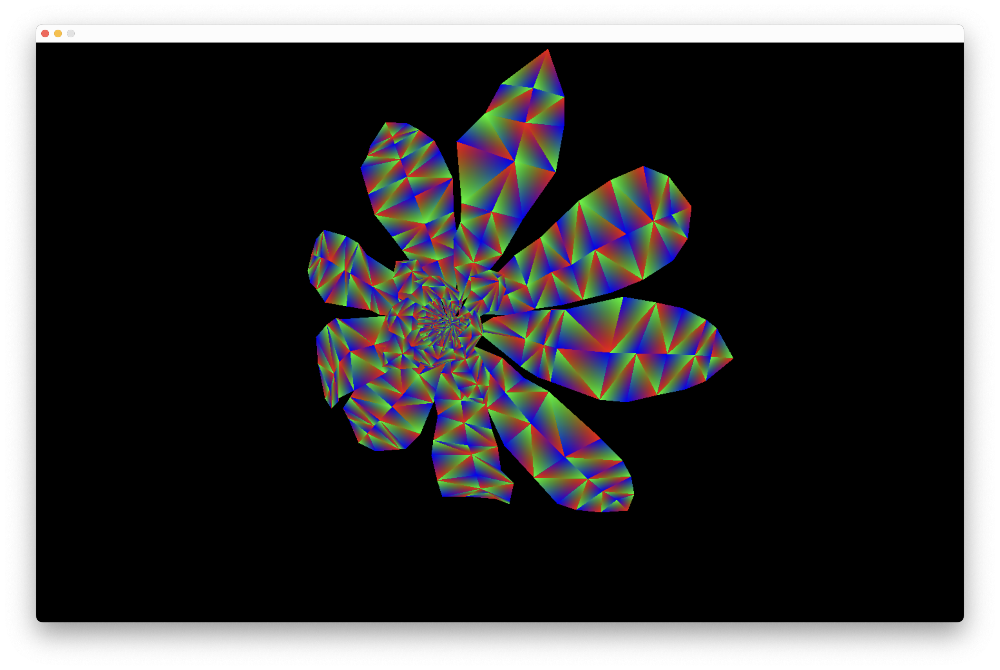
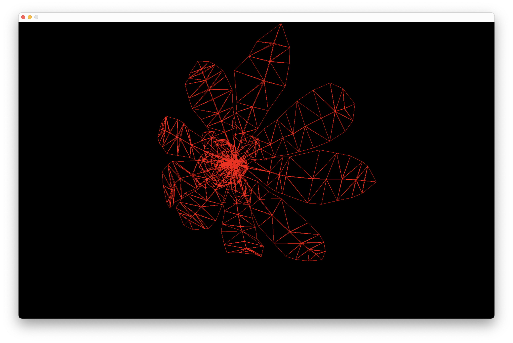
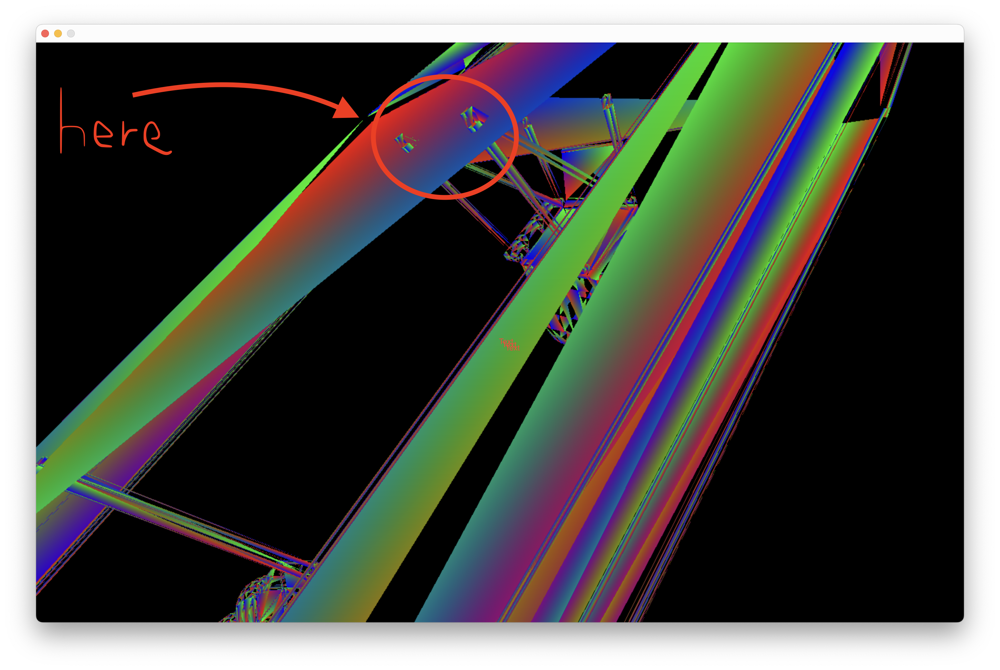

# Welcome To My 3d Rasterizor 😎
## Introduction
#### This project allows you to input a 3d OBJ file. The program then parses it for it's usefull data such as vertices and faces.

> ###### The fully rasterized object:

> ###### The same object but rendered using the wireframe mode:

#### This project was made for the sole purpose of me wanting to learn the fundamentals of 3d graphics, and so consequentially this project runs almost entirely on the CPU and does not take advantage of any Graphics API's like OpenGL or Vulkan. SDL2 is used for making a window and outputting to it.

#### Most of the code is written by me, but I can't take credit for the line drawing function, which was copied from a tutorial about the Bresenham line algorithm using integers. The triangle filling algorithm was also copied, although I made some modifications to it. And finally I stole the code for setting up the SDL window and drawing to it from ChatGPT, because I couldn't be bothered learning SDL, but I still know the jist of what the SDL code is doing.

## Compiling steps
#### This project has only one main file with no headers, mainly because I intended for this project to be much smaller when I started, but then I kept adding things and simply couldn't be bothered to reorganize everything. Because of this I would recommend using whatever c++ compiler you want to compile, but just make sure you run the compiled code inside the project folder so that it can recognize the object files inside the objects folder. Also make sure you include the path to your SDL2 in the compile command if you need to. I use clang to compile, and I installed SDL2 using brew, so my command would look like this:
    g++ -std=c++17 -g main.cpp -I/opt/homebrew/Cellar/sdl2/2.32.8/include/ -L/opt/homebrew/Cellar/sdl2/2.32.8/lib  -lSDL2 -o main

## Project Structure
####  For this project I decided to just organize everything into a bunch of structs and classes within one file. I also included a folder filled with a bunch of object files just so you can test out the renderer.

#### Every 3d object is represented in the following way:

#### We start by representing every individual vertice as a point struct, consisting of an x, y, z float.

    struct point{
        float x, y, z;
        bool operator==(const point& other) const {
            return x == other.x && y == other.y && z == other.z;
        }
    };

#### Then we have a triangle struct for representing faces. It consists of an array containing not points, but integers. 
    struct tri{
        int triangle[3];
    };

#### You can see the reason we use integers is to work as an index to the array of vertices stored inside the mesh struct shown below. We also have a list of triangles to represent the mesh, and some other members like a radius, which represents the radius of the smallest fitting sphere around the object. This becomes usefull for clipping. Finally theres a color member, which doesnt actually do anything but I added it in just in case me or anyone else ever wants to mess around with it in the future.

    struct mesh{
        std::vector<tri> obj;
        std::vector<point> points;
        float radius;
        color obj_color;
    };

## Creating and transforming the object

#### Inside the main function at the start the user is prompted with which file they want to use. You don't need to include the file extension when you type out the filename, but you can if you want.

    std::string file;
    std::cout << "Enter the 3d object file name:\n";
    std::cin >> file;
    if(file.length() < 5 || file.substr(file.length() - 4) != ".obj"){
        file+=".obj";
    }
    file = "./objects/" + file;

#### Then we create an object class which contains all of the methods and members needed. We then initilize some different things like the center point, which will be the starting coordinate of the object, and also the scale, which we use to scale the object along different axis.

    //Create object
    object shape;
    shape.center.x = 0.0f;
    shape.center.y = 0.0f;
    shape.center.z = 30.0f;
    point scale;
    scale.x = 1.0f;
    scale.y = 1.0f;
    scale.z = 1.0f;

#### We then call the import method, which takes in the name of the file we want to render, the scale, and the center point. The import function will parse the file and organize everything into a mesh, and also normalize every point to the origin so we can transform it to the inputed starting point. We also calculate the radius of the object. This function will return a mesh, so we store it in the obj member of our shape class.

    shape.obj = shape.import(file, scale, shape.center);

#### Then we initilize a vector point, which can optionally be used to rotate the object along a custom axis.

    //Create Vector for rotation of object
    point vector;
    vector.x = 1.0f;
    vector.y = 1.0f;
    vector.z = 1.0f;

#### After setting up SDL2 and everything, We then start the game loop. Inside the loop you will find a commented out rotation function, which takes in the mesh, the angle you want to rotate it by per frame, and the vector. The function will transform the mesh back to the origin by subtracting its center, and then rotate it along the vector using a rotation matrix. It then moves it back to it's position.

    //Rotate the object along a custom axis
    shape.rotate(shape.obj, 0.0174533, vector, shape.center);

#### Later on you find the part where we render it to the screen, we first call the clip function, which uses some fancy linear algebra to clip the object against five different planes defined by the fov in the clip method. Then we use a projection function to project every point onto screen space, and finally we use either the draw_fill or draw_wire method to either draw lines between points or fully rasterize each triangle. Currently, the rasterizing code uses arbitrarily defined colors for each point in each triangle. I did this just so I can test out the color interpolation and also so the rendered object is clearly visible. But some shading logic is needed to make it really work properly. I may add it in the future but for now this works fine.

    //For drawing a wireframe
    shape.draw_wire(shape.project(shape.clip(shape.obj, shape.center)));

    //For filling the triangles
    shape.draw_fill(shape.project(shape.clip(shape.obj, shape.center)));

#### After this there is some event handling, which is pretty simple and just uses WASD to move the camera around and SHIFT or SPACE to go up and down. But the thing is the camera never actually moves and is simply defined as the origin. To create the illusion of movement we simply transform the objects in the world instead. This has it's flaws, such as a specific direction always being relative to your perspective and not to the object. But it doesn't matter much to me since this isn't a game and is just an overly complicated excersize.

#### We also use the button q to toggle wireframe mode on or off, which simply just switches wether we use the wireframe drawing function or the triangle filling function.

    if(e.type == SDL_KEYDOWN){
        switch(e.key.keysym.sym){
            case SDLK_w:
                shape.tranZ(shape.obj, 1, true);
                shape.center.z -= 1;
                break;
            case SDLK_s:
                shape.tranZ(shape.obj, 1, false);
                shape.center.z += 1;
                break;
            case SDLK_a:
                shape.tranX(shape.obj, 1, false);
                shape.center.x += 1;
                break;
            case SDLK_d:
                shape.tranX(shape.obj, 1, true);
                shape.center.x -= 1;
                break;
            case SDLK_q:
                wireframe = !wireframe;
                break;
            case SDLK_LSHIFT:
                shape.tranY(shape.obj, 1, true);
                shape.center.y -= 1;
                break;
            case SDLK_SPACE:
                shape.tranY(shape.obj, 1, false);
                shape.center.y += 1;
                break;
            case SDLK_ESCAPE:
                run = false;
        }
    }

#### There is also some mouse input, which is used to rotate your head. To do this we simply calculate the change in the mouse's position, and then rotate the objects along the x and y axis individually using a different rotation matrix. But we also must rotate the rotation vector, in order to keep the objects smaller rotation along the vector consistent. We use the circle function for this. There are two versions of this function; One that takes in a mesh, and an overloaded one for taking in the vector point.

    if(e.type == SDL_MOUSEMOTION){
        int dx = e.motion.xrel;
        int dy = e.motion.yrel;
        float theta = ((float)(dx)*1.25*M_PI/(float)width);
        float beta = (-1 * (float)(dy)*1.25*M_PI/(float)height);
        shape.circle(shape.obj, theta, 'y');
        shape.circle(vector, theta, 'y');
        shape.circle(shape.center, theta, 'y');
        shape.circle(shape.obj, beta, 'x');
        shape.circle(vector, beta, 'x');
        shape.circle(shape.center, beta, 'x');
    }

## Some bugs in the code
#### This code is by no means on the level production value, as it has plenty of bugs in it, including one prominent one with certain triangles peeking through when they shouldn't.

#### I know why this is happening, it has to do with the z-buffering and clipping. When a triangle is clipped along a plane, the old z values at the old vertices outside the FOV are attached to the new vertices within the FOV range. This causes parts of triangles to appear in front of other triangles when they shouldn't. I could fix it by simply just interpolating the z-value when I clip the triangle but I don't really want to do it right now, even though I could probably fix it in like ten minutes.

## Conclusion
#### All in all, I think this project turned out to be a huge success for me, as I got to learn the fundementals of how 3d rasterizing works and all about linear algebra, while also sharpening my coding skills. In the future maybe I'll make some updates to this repo to fix some bugs and to include features like shading, but for now, I think this is plenty.

#### Thanks to anyone who stuck around to read this, feel free to take my code and mess around with it and make your own fixes/features.